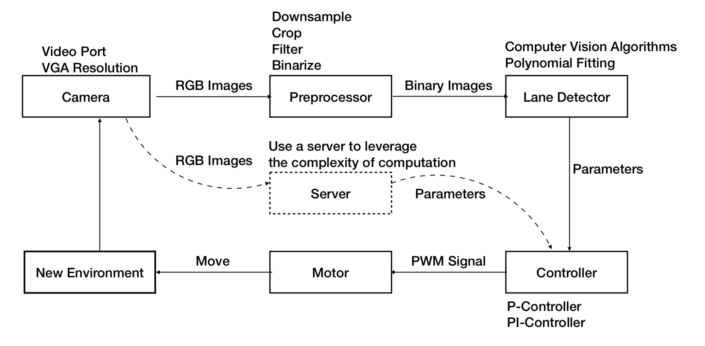
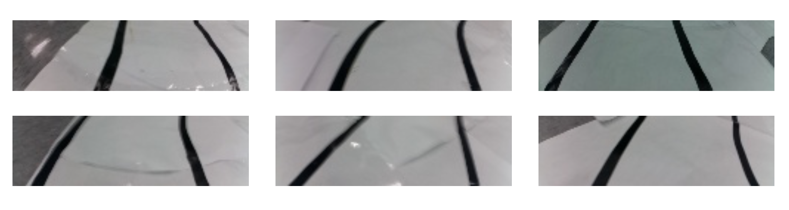
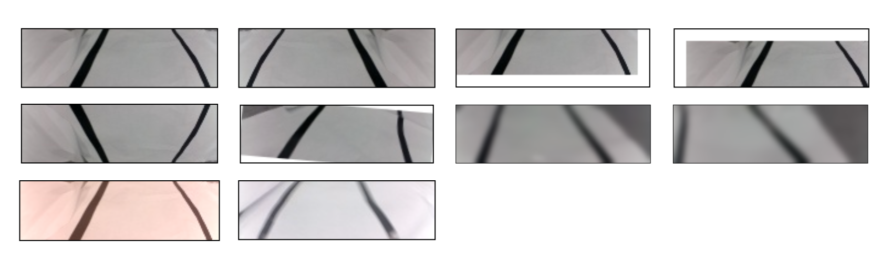
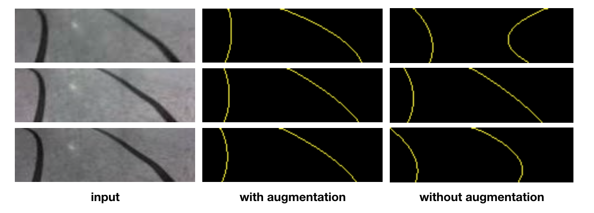
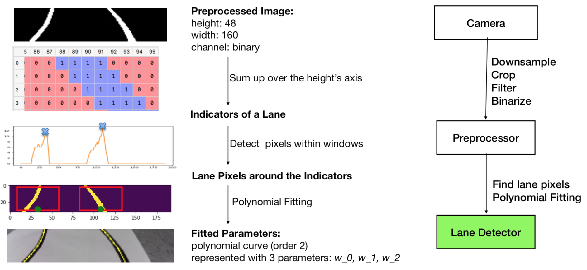
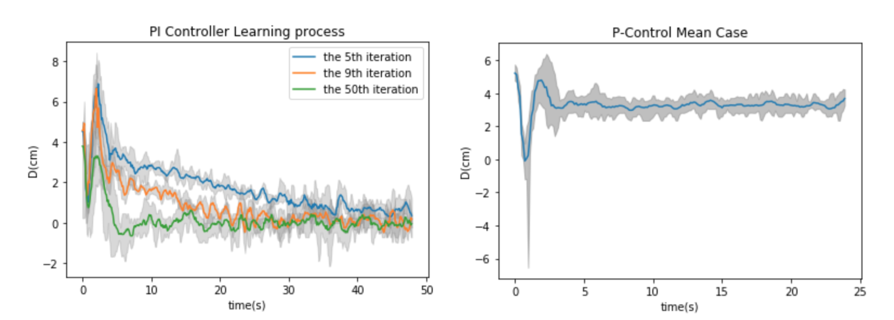

# CAN Self-Driving Project

## Project Overview

In this project, we applied Adapted Dynamic Programing method into the lane keeping task for self-driving cars.

During this project, we first control the car with a simple manually tuned controller to collect data. Then, based on the data we trained a new controller from sketch, and this controller has more parameters and better performance than the original one.

The learning processing is illustrated in the **result** part.

- [project slide](./res/lane-keeping.pdf)
- [video](./res/lane-keeping.mp4)



## Part 1: Lane Keeping

### 1.1 Environment

- Nvidia GeForce GTX 1080 (Server)
- Raspberry PI 3 based Cars (Client)
- Fisheye camera
- Circular Lane
- Ad-hoc Network
- TensorFlow, Python

### 1.2 Procedure

#### 1.2.0 Dataset Collection

First, we collected our own dataset using a manually tuned controller to run the car over and over. And in this project, we got 140 48*160 pictures for training our neural network.



#### 1.2.1 Model Training

We trained a simple Fully Convolutional Network with skip connection structure for lane detection.


During the training process, we also applied data augmentation (including mirroring, shifting, rotating, color shifting, blurring, and noising) in order to improve the performance of our neural network. And the augmented dataset is like:



The augmentation helped us to get a better result by improving the accuracy from 98.14% to 99.22%.



#### 1.2.2 Image Capture

We used a fisheye camera rather than regular camera for image capture, as it can see more information. And we used the `videoport` in API in order to get a high speed performance (about 8 ~ 10 fps).

#### 1.2.3 Data Preprocessing

The images captured by camera are also preprocessed by downsampling, cropping, filtering and biniarized before the lane detection.

#### 1.2.4 Lane Detection

We used polynomial fitting to represent the detected lane, and pass the weights of these curves for decision making in the next step.



#### 1.2.5 Decision Making

The controller are set with parameters we learned from data-driven ADP algorithm. And the `make_decision` function is called every time a new image is processed.

#### 1.2.6 Motor Control

For motor control, we constructed a class `Motor` which used `PWM` to control the left side and right side motors of the car, so that the car can go straight, turn left or turn right.

### 1.3 Result

We can see the performance is getting better and better among the iteration of training. Here the `D` in the y-axis indicates the distance between the car and the center of the lane.

Righthand side is our base-line: a mannually tuned controller.



## Deploy & Test

```shell
python -m module name
# For Example
# test modules
python -m tests.test-detector

# test project
python -m tests.test-car online-single # online test (single thread version)
python -m tests.test-car offline       # offline test
```
